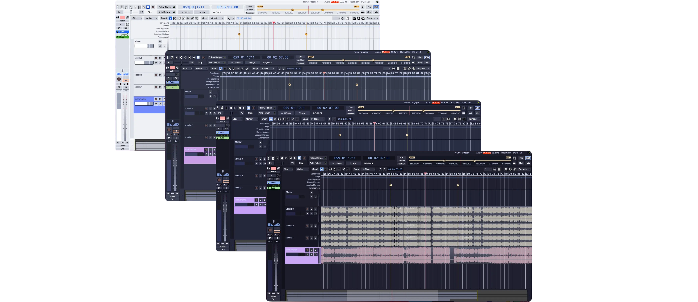

<h3 align="center">
	<br/>
	
	Catppuccin for <a href="https://github.com/Ardour/ardour">Ardour</a>
	
</h3>

<p align="center">
	<a href="https://github.com/catppuccin/ardour/stargazers"></a>
	<a href="https://github.com/catppuccin/ardour/issues"></a>
	<a href="https://github.com/catppuccin/ardour/contributors"></a>
</p>

<p align="center">
	
</p>

## Previews

<details>
<summary>🌻 Latte</summary>

</details>
<details>
<summary>🪴 Frappé</summary>

</details>
<details>
<summary>🌺 Macchiato</summary>

</details>
<details>
<summary>🌿 Mocha</summary>

</details>

## Usage

1. Identify the path for your Ardour themes folder. In linux it's usually on '~/.config/Ardour/Contents/Resources/themes', in macos it's on '/Applications/Ardour8.app/Contents/Resources/themes/'.
2. Download the flavour files to the Ardour themes folder:
```bash
curl -LO --output-dir path/to/ardour/themes https://github.com/catppuccin/ardour/raw/main/catppuccin_latte-ardour.colors
```
```bash
curl -LO --output-dir path/to/ardour/themes https://github.com/catppuccin/ardour/raw/main/catppuccin_frappe-ardour.colors
```
```bash
curl -LO --output-dir path/to/ardour/themes https://github.com/catppuccin/ardour/raw/main/catppuccin_macchiato-ardour.colors
```
```bash
curl -LO --output-dir path/to/ardour/themes https://github.com/catppuccin/ardour/raw/main/catppuccin_mocha-ardour.colors
```
3. Open the app and go to **Preferences** > **Appearance** > **Colors**.
4. Select the desired flavor from the **Color Theme** list.

<!-- The FAQ section is optional. Remove if needed.-->
## 🙋 FAQ

- Q: **_"How can I change the colors for an specific button/text/component?"_**\
  A: You can modify what color is used by any of the GUI components in the .color files. Nonetheless, it is easier to do that inside Ardour, in Preferences > Appearance > Colors > Items, where the full list of objects is presented.

## 💝 Thanks to

- [vlermandac](https://github.com/vlermandac)

&nbsp;

<p align="center">
	
</p>

<p align="center">
	Copyright &copy; 2021-present <a href="https://github.com/catppuccin" target="_blank">Catppuccin Org</a>
</p>

<p align="center">
	<a href="https://github.com/catppuccin/catppuccin/blob/main/LICENSE"></a>
</p>
